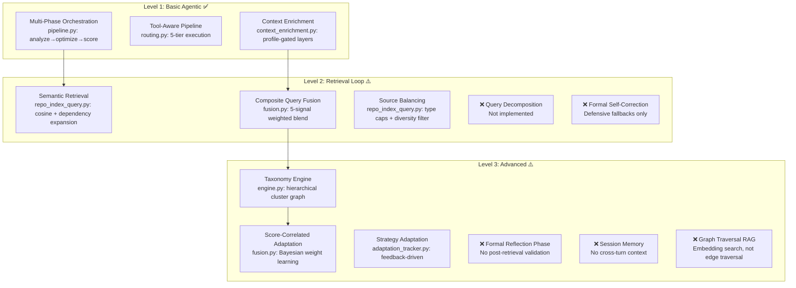

# Agentic RAG Pipeline Audit — Part 1: Framework Mapping & Tiered Recommendations

> **Date:** 2026-05-07
> **Scope:** Full RAG pipeline audit against the 3-level Agentic RAG framework
> **Reference:** [Agentic RAG Explained in 3 Levels of Difficulty](https://machinelearningmastery.com/agentic-rag-explained-in-3-levels-of-difficulty/)
> **Companion:** [Part 2 — Deep-Dive Component Analysis](./agentic-rag-audit-part2.md)

---

## Table of Contents

1. [Executive Summary](#executive-summary)
2. [Agentic RAG Framework Overview](#agentic-rag-framework-overview)
3. [Current Architecture Maturity Map](#current-architecture-maturity-map)
4. [Level 1 Assessment: Basic Agentic RAG](#level-1-assessment-basic-agentic-rag)
5. [Level 2 Assessment: Advanced Retrieval Loop](#level-2-assessment-advanced-retrieval-loop)
6. [Level 3 Assessment: Production Architectures](#level-3-assessment-production-architectures)
7. [Tiered Optimization Roadmap](#tiered-optimization-roadmap)

---

## Executive Summary

Project Synthesis (PromptForge v2) implements a sophisticated prompt optimization pipeline that already operates at **Level 2 Agentic RAG** maturity with significant Level 3 elements. The system features multi-phase orchestration (analyze → optimize → score), composite embedding fusion with 5-signal queries, a hierarchical taxonomy engine functioning as a structural knowledge graph, and adaptive learning through score-correlated weight adaptation.

**Current strengths:**
- Multi-phase pipeline with tool-aware orchestration (Level 1 ✅)
- Semantic retrieval with source-type balancing and dependency expansion (Level 2 ✅)
- Composite query fusion with 5 weighted signals (Level 2+ ✅)
- Hierarchical taxonomy with cluster-level knowledge graph (Level 3 partial ✅)
- Feedback-driven adaptation with Bayesian shrinkage (Level 3 partial ✅)

**Key gaps identified:**
- No explicit query decomposition for complex multi-intent prompts
- Linear pipeline lacks formal self-correction/reflection loop
- Taxonomy engine is structural but not a formal graph traversal system
- No short-term session memory across optimization turns
- Error handling is defensive (swallow + fallback) rather than reflective

---

## Agentic RAG Framework Overview

The article defines three progressive levels of Agentic RAG sophistication:

### Level 1 — Basic Agentic RAG (Reasoning & Tools)

Traditional RAG follows a fixed sequence: query → retrieve → generate. It cannot reason about retrieval quality, retry failed searches, or route queries to different sources. Level 1 adds:

| Capability | Description |
|---|---|
| **Planning** | Breaking complex queries into subtasks before retrieval |
| **Tool Use** | Going beyond vector stores — SQL, APIs, web search, code execution |
| **Iterative Refinement** | Evaluating retrieval results, retrying with rephrased queries, resolving conflicts |

### Level 2 — Advanced Retrieval Loop

Level 2 introduces a closed-loop retrieval cycle with intelligent routing:

| Capability | Description |
|---|---|
| **Query Decomposition** | Splitting multi-faceted queries into latent sub-queries |
| **Source Routing** | Directing sub-queries to the most appropriate retrieval backend |
| **Multi-Hop Retrieval** | Chaining retrievals where result N informs query N+1 (RQ-RAG, RAG-Fusion) |
| **Self-Correction** | Checking relevance scores, detecting contradictions, re-querying on low confidence |

### Level 3 — Advanced Architectures & Production Tradeoffs

Level 3 adds structural reasoning, memory, and quality gates:

| Capability | Description |
|---|---|
| **Graph RAG** | Building knowledge graphs for relationship-heavy queries instead of flat vector search |
| **Reflection** | Reviewing draft answers for gaps, hallucinations, or missing context before finalizing |
| **Memory** | Short-term (session context) and long-term (learning from past successes/failures) |
| **Production Tradeoffs** | Latency budgets, cost management, complexity governance |

---

## Current Architecture Maturity Map



### Maturity Scorecard

| Agentic RAG Capability | Status | Coverage | Key Files |
|---|---|---|---|
| **Planning (multi-phase)** | ✅ Implemented | 90% | `pipeline.py`, `routing.py` |
| **Tool Use (multi-source)** | ✅ Implemented | 85% | `routing.py`, `context_enrichment.py` |
| **Iterative Refinement** | ✅ Implemented | 80% | `refinement_service.py` |
| **Query Decomposition** | ❌ Missing | 0% | — |
| **Source Routing** | ⚠️ Partial | 60% | `repo_index_query.py` (type caps) |
| **Multi-Hop Retrieval** | ⚠️ Partial | 40% | `matching.py` (2-level cascade) |
| **Self-Correction** | ⚠️ Partial | 30% | Defensive fallbacks, no formal loop |
| **Graph RAG** | ⚠️ Partial | 50% | `taxonomy/` (structural, not traversal) |
| **Reflection** | ❌ Missing | 0% | — |
| **Short-Term Memory** | ❌ Missing | 0% | — |
| **Long-Term Memory** | ✅ Implemented | 75% | `MetaPattern`, `GlobalPattern`, `fusion.py` |
| **Production Tradeoffs** | ✅ Implemented | 85% | Budget caps, token limits, z-score normalization |

---

## Level 1 Assessment: Basic Agentic RAG

### 1.1 Planning — Multi-Phase Orchestration ✅

**Article principle:** "The agent can break a complex question into sub-tasks, deciding which tools or retrievals to call and in what order."

**Our implementation:** `PipelineOrchestrator.run()` in `pipeline.py` executes a 3-phase pipeline:

```
Phase 1: Analyze  → HeuristicAnalyzer classifies task_type, domain, weaknesses
Phase 2: Optimize → LLM generates optimized prompt with strategy + enriched context
Phase 3: Score    → Hybrid scoring (LLM + heuristic + z-score normalization)
```

Each phase uses a separately configurable LLM model (via `PreferencesService.resolve_model()`), with independent effort levels and token budgets. The `HeuristicAnalyzer` provides zero-LLM classification with confidence-gated LLM fallback (A4), making Phase 1 nearly free in most cases.

**Assessment:** Strong implementation. The pipeline is explicitly multi-phase with independent provider calls per phase, not a monolithic prompt. The `context_enrichment.py` service gates context layers (codebase, strategy intelligence, patterns) based on prompt state, task type, and history — this is planning-level intelligence about *what context to retrieve*.

**Gap:** Planning is static (always analyze→optimize→score). The pipeline doesn't adaptively skip phases or reorder based on prompt characteristics. A trivial prompt gets the same phase structure as a complex multi-domain one.

### 1.2 Tool Use — Multi-Source Retrieval ✅

**Article principle:** "Going beyond a single vector store to use SQL databases, web search, APIs, and code execution."

**Our implementation spans 6 distinct retrieval sources:**

| Source | Implementation | Gate |
|---|---|---|
| Codebase (semantic) | `repo_index_query.py` | `repo_relevance.py` B0 gate |
| Pattern injection | `pattern_injection.py` | Cluster membership + global_source_count |
| Strategy intelligence | `strategy_intelligence.py` | Historical avg_score ≥3 samples |
| Domain vocabulary | `DomainSignalLoader` | Organic keyword signals |
| Taxonomy mapping | `taxonomy/matching.py` | Cosine threshold cascade |
| User feedback | `adaptation_tracker.py` | Approval rate + degenerate check |

The `routing.py` engine implements a 5-tier priority chain (`force_passthrough > force_sampling > internal > auto_sampling > passthrough`) that routes execution to the appropriate provider based on capability detection.

**Assessment:** Excellent multi-source retrieval. The B0 relevance gate (`repo_relevance.py`) prevents unrelated codebase injection using cosine similarity + domain-vocab overlap + identifier matching. The composite query fusion (`fusion.py`) blends 5 signals (topic, transformation, output, pattern, qualifier) with per-phase weight profiles — this is significantly more sophisticated than basic tool use.

### 1.3 Iterative Refinement ✅

**Article principle:** "The agent evaluates retrieval results, retries with rephrased queries, and resolves conflicting information."

**Our implementation:** `RefinementService.create_refinement_turn()` runs a full pipeline per turn (analyze → refine → score → suggest) with:
- Version history and branching (`RefinementBranch`, `RefinementTurn`)
- Score trajectory tracking ("improving", "degrading", "oscillating")
- Strongest-dimension protection (top-2 dimensions highlighted for the refiner)
- Actionable suggestion generation with trajectory-aware prompts

**Assessment:** Strong iterative refinement for the *optimization* task. However, the *retrieval* step itself is not iterative — if pattern injection returns low-relevance patterns, the system doesn't retry with a rephrased query or fall back to a broader search.

---

## Level 2 Assessment: Advanced Retrieval Loop

### 2.1 Query Decomposition ❌

**Article principle:** "Split a multi-faceted query into latent sub-queries, each targeting a specific aspect."

**Our implementation:** Not present. The pipeline processes the raw prompt as a single unit through all phases. The `HeuristicAnalyzer` classifies task_type and domain but doesn't decompose a complex prompt like "Write a REST API with auth, add database migrations, and set up CI/CD" into three sub-queries targeting different retrieval sources.

**Impact:** For simple single-intent prompts (80% of usage), this is fine. For complex multi-intent prompts, the system retrieves context for the dominant intent and may miss relevant patterns for secondary intents.

### 2.2 Source Routing ⚠️ Partial

**Article principle:** "Route each sub-query to the most appropriate retrieval backend."

**Our implementation:** The `context_enrichment.py` service gates context layers based on profile detection:

```python
# Profile-based gating (context_enrichment.py)
profiles: code_aware, knowledge_work, cold_start
→ gates: codebase_context, strategy_intelligence, pattern_injection
```

The `repo_index_query.py` applies source-type balancing (max 3 per source type) and directory diversity caps (max 2 per directory). But this is *filtering*, not *routing* — all sources are queried and then filtered, rather than selectively querying the most relevant source per sub-query.

### 2.3 Multi-Hop Retrieval ⚠️ Partial

**Article principle:** "Chain retrievals where the result of retrieval N informs query N+1 (RQ-RAG, RAG-Fusion patterns)."

**Our implementation has two multi-hop-like patterns:**

1. **Taxonomy cascade** (`matching.py`): Level 1 searches leaf families → on miss, Level 2 falls back to parent clusters → aggregates top-3 child patterns by cosine similarity to the query. This is a 2-level hierarchical retrieval.

2. **Dependency graph expansion** (`repo_index_query.py`): After initial semantic search, expands results via import-graph and markdown-reference resolution. Retrieved file A's imports are followed to include file B.

**Gap:** Neither pattern is a true multi-hop loop where *the content of retrieved results* generates a new query. The taxonomy cascade is a fallback hierarchy (broader search on miss), and dependency expansion follows static graph edges, not semantic reformulation.

### 2.4 Self-Correction & Validation ⚠️ Partial

**Article principle:** "Check relevance of retrieved documents, detect contradictions, re-query on low confidence."

**Our implementation:**
- `repo_relevance.py`: B0 gate checks cosine similarity + domain-vocab overlap before injecting codebase context. This is *pre-retrieval* gating, not post-retrieval validation.
- `score_blender.py`: Divergence detection flags dimensions where LLM and heuristic scores disagree by >2.5 points. This is post-*scoring* validation, not post-*retrieval*.
- `context_enrichment.py`: Divergence alerts when composite fusion Q detects retrieval drift.

**Gap:** No formal "retrieval judge" that evaluates whether retrieved patterns/context actually answer the prompt's intent before passing them to the optimizer. The system trusts its retrieval or silently degrades via defensive error handling.

---

## Level 3 Assessment: Production Architectures

### 3.1 Graph RAG ⚠️ Partial

**Article principle:** "Build knowledge graphs that capture relationships between entities, enabling multi-hop reasoning over structured data."

**Our implementation — the Taxonomy Engine:**

The `taxonomy/` module implements a hierarchical knowledge graph:

```
Domain (state="domain")
  └── PromptCluster (state="active"|"mature"|"candidate")
       └── Family (leaf clusters, parent_id != null)
            └── MetaPattern (techniques/patterns per cluster)
            └── GlobalPattern (cross-cluster promoted patterns)
```

Key graph operations:
- **Warm path** (`warm_path.py`): 7-phase lifecycle — reconcile → evaluate → split/emerge → merge → retire → refresh → discover
- **Cold path** (`cold_path.py`): Full HDBSCAN refit + UMAP 3D projection + OKLab coloring
- **Quality gates**: Per-phase Q gates (`is_non_regressive()`) prevent taxonomy degradation
- **Composite fusion** (`fusion.py`): 5-signal query with per-phase weight profiles and Bayesian shrinkage learning

**Assessment:** This is structurally richer than a flat vector store — it has parent-child relationships, cluster membership, cross-cluster pattern promotion, and learned weight profiles. However, it's queried via **embedding similarity search**, not **graph traversal**. The system finds the nearest cluster by cosine distance, not by walking edges (e.g., "find all patterns in clusters related to the same domain that have high avg_score and were recently validated by user feedback").

### 3.2 Reflection ❌

**Article principle:** "The agent reviews its draft answer for gaps, hallucinations, or missing context before finalizing."

**Our implementation:** Not present as a formal phase. The closest analogues:
- Hybrid scoring (LLM + heuristic) provides *post-hoc* quality assessment
- Divergence flags detect LLM/heuristic disagreement
- Suggestion generation identifies weaknesses in the output

**Gap:** No intermediate "reflection" step between retrieval and generation that asks: "Is the retrieved context sufficient and relevant? Should I retrieve more? Is there a contradiction between the codebase context and the pattern injection?"

### 3.3 Memory ⚠️ Partial

**Article principle:** "Short-term memory (session context across turns) and long-term memory (learning from past successes for future efficiency)."

**Long-term memory ✅ (strong):**
- `MetaPattern` / `GlobalPattern`: Persistent pattern library with `source_count` / `global_source_count` tracking
- `fusion.py`: Score-correlated weight adaptation with Bayesian shrinkage (`compute_score_correlated_target()`)
- `AdaptationTracker`: Strategy affinity learning from user feedback with degenerate detection
- `StrategyIntelligence`: Historical strategy performance by domain + task_type

**Short-term memory ❌:**
- No session context across optimization turns (each `PipelineOrchestrator.run()` is stateless)
- Refinement service maintains version history but doesn't carry *retrieval context* forward
- No "this user tends to prefer X" within a session

### 3.4 Production Tradeoffs ✅

**Our implementation is mature on production concerns:**

| Concern | Implementation |
|---|---|
| **Token budgets** | `pipeline_constants.py`: per-phase max_tokens, dynamic compute based on prompt length |
| **Latency** | Cold-path latency reservoir with p50/p95 tracking; async cooperative yields |
| **Cost** | Effort levels per phase (low/medium/high); Haiku for cheap phases |
| **Scoring bias** | Z-score normalization to break LLM score clustering; asymmetric cap (C1) |
| **Concurrency** | `WriteQueue` single-writer serialization; `_COLD_PATH_LOCK` for cold path |
| **Degradation** | Defensive fallbacks everywhere; non-fatal error handling for side-effects |

---

## Tiered Optimization Roadmap

### Tier 4 — Quick Wins (Highest ROI, Lowest Effort)

| # | Optimization | Effort | Impact | Files |
|---|---|---|---|---|
| 4.1 | **Retrieval confidence scoring** — After pattern injection, compute a confidence score for the retrieved set. Log it. When confidence < threshold, inject a "low retrieval confidence" signal into the optimizer prompt so the LLM knows to rely less on injected patterns. | 2-3 hrs | Medium | `pattern_injection.py`, `context_enrichment.py` |
| 4.2 | **Context budget rebalancing by task type** — Coding prompts should allocate more budget to codebase context; writing prompts to pattern context. Currently the char budget is uniform. | 1-2 hrs | Medium | `repo_index_query.py`, `pipeline_constants.py` |
| 4.3 | **Post-retrieval relevance filter** — After `query_curated_context()` returns, compute pairwise cosine between retrieved chunks and the prompt embedding. Drop chunks below a floor (e.g., 0.25). Currently all retrieved chunks are injected. | 2-3 hrs | Medium | `repo_index_query.py` |
| 4.4 | **Enrichment profile telemetry** — Log which enrichment profile was selected and what context layers were activated. This data enables future optimization of the profile gating thresholds. | 1 hr | Low (enables future gains) | `context_enrichment.py` |

### Tier 3 — Medium Effort, High Impact

| # | Optimization | Effort | Impact | Files |
|---|---|---|---|---|
| 3.1 | **Retrieval validation gate** — Add a lightweight post-retrieval check between enrichment and optimization. Use heuristic signals (not LLM) to validate: does the retrieved context contain keywords from the prompt? Is the total retrieved context >50% relevant? If not, re-query with broader thresholds or skip context injection. | 1-2 days | High | `context_enrichment.py`, new `retrieval_validator.py` |
| 3.2 | **Adaptive phase skipping** — When `HeuristicAnalysis.confidence > 0.9` and the prompt is simple (< 100 words, single intent), skip the full analyze phase and use the heuristic result directly. When the prompt has no codebase relevance (B0 gate fails), skip codebase retrieval entirely rather than running the query and getting empty results. | 1 day | Medium | `pipeline.py`, `context_enrichment.py` |
| 3.3 | **Graph-aware pattern retrieval** — Instead of only searching by cosine similarity to the prompt, also retrieve patterns from clusters that share the same parent domain node. Walk parent→sibling edges in the taxonomy to find related patterns the embedding search missed. | 2-3 days | High | `taxonomy/matching.py`, `pattern_injection.py` |
| 3.4 | **Session context for refinement** — Carry the retrieval context (which patterns were injected, which codebase files were included) forward across refinement turns. Currently each turn re-retrieves from scratch. | 1-2 days | Medium | `refinement_service.py`, `context_enrichment.py` |

### Tier 2 — Significant Effort, Major Impact

| # | Optimization | Effort | Impact | Files |
|---|---|---|---|---|
| 2.1 | **Query decomposition engine** — Before enrichment, analyze the prompt for multiple intents. Split "Write a REST API with auth and add database migrations" into sub-queries ["REST API implementation", "authentication", "database migrations"]. Retrieve context for each sub-query independently, then merge the context sets. | 1-2 weeks | Very High | New `query_decomposer.py`, `pipeline.py`, `context_enrichment.py` |
| 2.2 | **Formal reflection phase** — After the optimizer generates an output, run a lightweight "reflection" LLM call that checks: (1) Does the output address all intents from the original prompt? (2) Are there contradictions between the output and the injected context? (3) Are there gaps that warrant re-retrieval? If reflection detects issues, loop back to enrichment with a refined query. | 1-2 weeks | Very High | New `reflection_service.py`, `pipeline.py` |
| 2.3 | **Multi-hop retrieval loop** — Implement RQ-RAG pattern: after initial retrieval, extract entities/concepts from retrieved patterns, generate follow-up queries, and retrieve again. Cap at 2-3 hops with a relevance decay threshold. | 1-2 weeks | High | `pattern_injection.py`, `taxonomy/matching.py` |
| 2.4 | **Graph traversal queries** — Extend taxonomy matching to support explicit edge traversal: "find patterns from clusters in the same domain with avg_score > 7 that were validated by thumbs_up feedback." This requires building query primitives that walk the PromptCluster tree by relationship, not just by embedding distance. | 2-3 weeks | High | `taxonomy/matching.py`, `taxonomy/engine.py` |

### Tier 1 — Architectural Shifts (Highest Effort, Transformative)

| # | Optimization | Effort | Impact | Files |
|---|---|---|---|---|
| 1.1 | **Full agent loop architecture** — Replace the linear pipeline with a ReAct-style agent loop where the LLM decides at each step whether to (a) retrieve more context, (b) generate output, (c) reflect on output quality, or (d) finalize. The current 3-phase pipeline becomes 3 *tools* the agent can invoke in any order. | 4-8 weeks | Transformative | Major refactor of `pipeline.py`, `routing.py` |
| 1.2 | **Formal knowledge graph with edge types** — Migrate from the current structural taxonomy (parent-child only) to a typed knowledge graph with explicit edge types: `RELATED_TO`, `DERIVED_FROM`, `CONTRADICTS`, `SUPERSEDES`. Enable SPARQL-like queries over the graph. Consider Neo4j or a lightweight in-process graph DB. | 4-8 weeks | Transformative | Major refactor of `taxonomy/` |
| 1.3 | **Cross-session learning agent** — Build a meta-learning layer that observes patterns across sessions: "For coding+backend prompts, chain-of-thought strategy with codebase context consistently scores >8.0" → automatically bias future routing for similar prompts. Currently the fusion weight adaptation does this partially but only within the embedding weight space, not at the strategy/retrieval-source level. | 3-4 weeks | High | New `meta_learner.py`, integration across pipeline |
| 1.4 | **Parallel retrieval with result fusion** — For decomposed queries, retrieve from multiple sources in parallel (codebase, taxonomy, strategy DB) and fuse results using a learned merger that weights source reliability per task type. Currently retrieval is sequential within `context_enrichment.py`. | 2-3 weeks | High | `context_enrichment.py`, `pipeline.py` |

---

> **Continue to [Part 2 — Deep-Dive Component Analysis](./agentic-rag-audit-part2.md)** for detailed per-component analysis, code-level findings, and specific implementation guidance for each tier.
